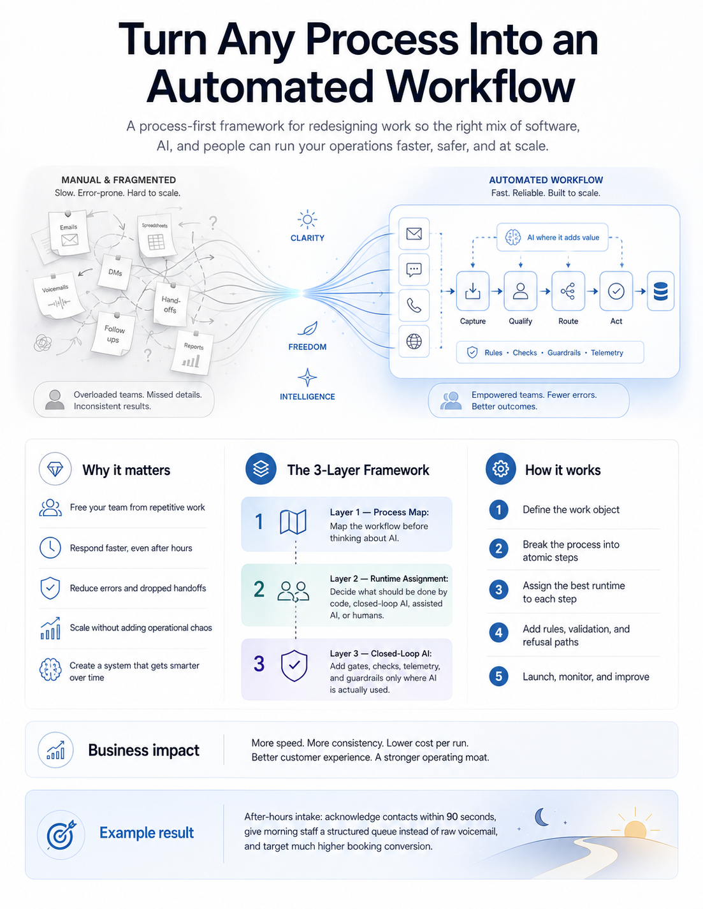
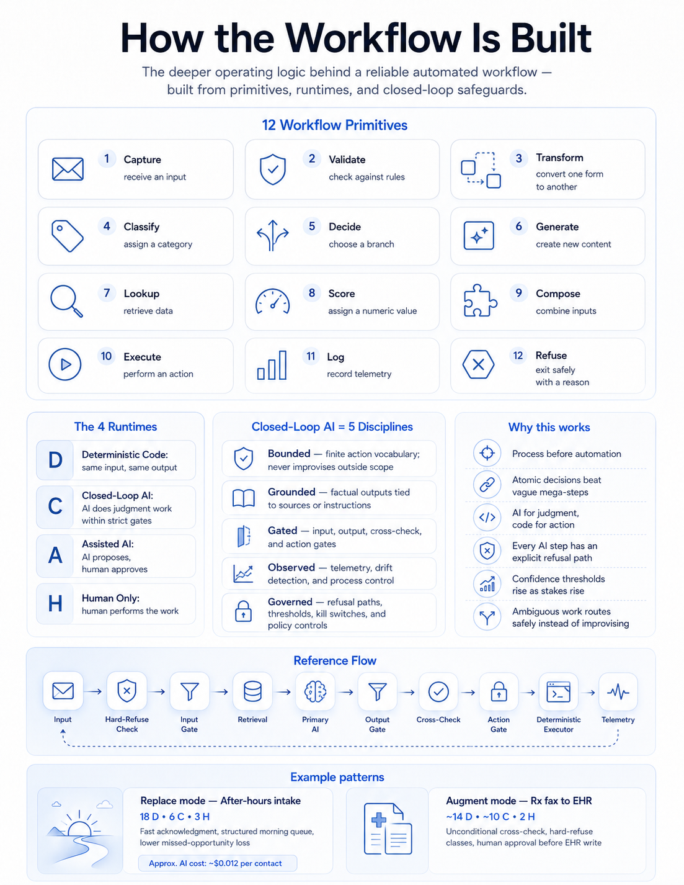

# AAC — Agent Automation Creator

**AAC 2.0: a process-first framework and creation-time operating package for AI-augmented workflows and agents.**

Most failed AI projects design the AI first and try to fit a process around it. AAC reverses the order. Map the process correctly. Then assign the right runtime to each piece of work. Then apply closed-loop AI discipline at the node and agent-envelope level.

The result is workflows that are fast, reliable, observable, governed, and cost-disciplined. Not a vibe. AAC 2.0 is a specification, an assessment instrument, a creation gate, and a CI-enforceable card model.



---

## Why AAC is now 2.0

The earlier update was labeled as a practice-layer addendum because the core v1.1 rubric did not change. That was too conservative once AAC started governing **agent creation**, not just workflow assessment.

AAC 2.0 is justified because the contract changed:

1. **Before build** — weak agent prompts/specs now fail at the front door.
2. **Before merge** — workflow/node/agent cards are review artifacts, not optional notes.
3. **Before runtime** — max lane, owner, residue, kill switch, and run-card proof are required before higher-blast-radius execution.
4. **Across surfaces** — the same AAC packet can travel through Hermes, GitHub, Claude Code, Codex, Gemini, and manual chat.

The v1.1 core remains intact. AAC 2.0 = **v1.1 core rubric + creation gates + boundary model + artifacts + enforcement**.

---

## What's in this repo

| File | What it is | Who it's for |
|---|---|---|
| [`docs/AAC-v2.0.md`](docs/AAC-v2.0.md) | Canonical AAC 2.0 operating package: v1.1 core plus creation gates, boundary model, card artifacts, and enforcement | Builders, operators, vendors, auditors |
| [`docs/AAC-v1.1.pdf`](docs/AAC-v1.1.pdf) | Core rubric reference snapshot, 34 pages, 57 items | Builders, operators, vendors, auditors |
| [`docs/AAC-boundary-creation-addendum-v0.1.md`](docs/AAC-boundary-creation-addendum-v0.1.md) | Backward-compatible pointer to AAC v2.0 for older links | Existing readers |
| [`docs/aac/`](docs/aac/) | Example workflow, node, agent, registry, and run-card artifacts for GitHub enforcement | Teams making agent changes reviewable before merge |
| [`schemas/aac-card.schema.json`](schemas/aac-card.schema.json) | Minimal workflow/node/agent card schema | Tooling and CI validators |
| [`scripts/aac_gate.py`](scripts/aac_gate.py) | Dependency-free GitHub Actions validator for AAC cards and cross-references | Repos that want AAC as a required PR check |
| [`docs/turn-any-process-into-a-workflow.png`](docs/turn-any-process-into-a-workflow.png) | One-page visual explainer: manual chaos vs automated workflow | Execs, clients, prospects |
| [`docs/how-the-workflow-is-built.png`](docs/how-the-workflow-is-built.png) | Deeper visual: 12 primitives, 4 runtimes, 5 disciplines, reference flow | Builders, technical reviewers |
| [`skills/agenttwin/`](skills/agenttwin/) | A drop-in AI assistant skill that runs AAC/AgentTwin assessment on workflow, node, and agent-envelope health | Anyone running AI agents |
| [`examples/example-recall-outreach.html`](examples/example-recall-outreach.html) | Fully-rendered sample AgentTwin report | Anyone evaluating the framework |

---

## The framework in one screen



AAC has three layers. You build bottom-up. You cannot skip a layer.

**Layer 1: Process Map.** Draw the workflow before thinking about AI. Three levels of granularity: work elements (atomic, one verb each), nodes (transactional groupings with one owner), processes (the full graph with triggers, edges, queues, sinks).

**Layer 2: Runtime Assignment.** Every work element gets exactly one of four runtimes: Deterministic Code (D), Closed-Loop AI (C), Assisted AI (A), or Human Only (H). The runtime is read off the work's attributes, not chosen by preference. Cheapest runtime that satisfies all constraints wins.

**Layer 3: Closed-Loop AI Framework.** Applies only to work assigned to C. Five disciplines, all required:

| Discipline | What it means |
|---|---|
| **Bounded** | Finite, code-enumerated action vocabulary. AI never picks the action class. |
| **Grounded** | Factual claims tied to retrieved sources. Every claim has a source ID. |
| **Gated** | Input gate, output gate, cross-check gate, action gate. All four must pass. |
| **Observed** | Per-run telemetry. Drift monitored on input, output, and confidence independently. |
| **Governed** | Refusal is always available. Confidence thresholds explicit. Kill switches per action class. |

If any of the five fails, the element runs as Assisted AI until fixed. No exceptions.

---

## Boundary model for agentic systems

AAC does not certify "an agent" abstractly. It certifies a bounded system:

1. **Workflow Box** — the business/process object moving from trigger to finish.
2. **Node** — one bounded work element inside that workflow.
3. **Agent Envelope** — the actor/runtime allowed to perform one or more nodes.
4. **Run Card** — evidence from one execution.

Core rule:

> A node is the work. An agent is the performer. A workflow is the box. A run card is the proof.

Before applying AAC or AgentTwin, declare the box being judged and the control topology: `unit`, `graph_directed`, `agent_directed_envelope`, or `hybrid`. If the box is undefined, the correct verdict is `FAIL: box undefined`.

The five disciplines apply twice:

- **At the node level** — every node declares runtime mode, max lane, gates, telemetry, refusal, and kill switch.
- **At the agent-envelope level** — every actor declares tools, allowed action classes, forbidden action classes, memory policy, telemetry, owner, residue accepter, and kill switch.

Effective permission is always the most restrictive intersection of workflow max lane, node max lane, agent envelope, tool permission, user approval, and runtime gate result. An agent never upgrades itself from draft to send.

See [`docs/AAC-v2.0.md`](docs/AAC-v2.0.md) for the canonical AAC 2.0 operating package.

---

## Active draft proposal: AAC 2.5 factory layer

AAC 2.0 remains the canonical operating package. The active draft proposal in [`docs/proposals/AAC-v2.5-draft.md`](docs/proposals/AAC-v2.5-draft.md) explores the next layer: turning a raw agent idea into an interviewed, graphed, carded, evaluated, launched, and improved workflow.

The draft adds a Flow Interviewer front door, compiler/evaluator/improver contracts, and versioned golden sets so agent quality is measured against known-right examples instead of vibes. It is not canonical until the remaining human gates clear and the version decision is made.

---

## Why this exists

AI workflows fail in predictable ways:
- Mega-nodes that do ten things, with no clean rollback
- Implicit decisions buried inside prose ("if it seems urgent, escalate")
- AI selecting the action class instead of just the parameters
- No refuse path, so the system improvises under uncertainty
- Telemetry that's just logs, not control charts
- Cost that creeps because cheap models are never re-benchmarked

AAC names each of these and gives you the structural fix. The 57-item rubric in the PDF walks every check. Pass it = production-ready. Fail any A/B/C item = redesign before build.

The framework has been pressure-tested against two structurally different real workflows: a high-volume, low-stakes Replace mode (after-hours intake at an optometry practice, ~80 calls/day, $0.012 per contact) and a low-volume, high-stakes Augment mode (Rx fax to RevolutionEHR entry, ~5 faxes/day, permanent human approval, $0.048 per fax). The 8 changes from v1.0 to v1.1 came from running the Rx workflow and finding what the original framework missed.

---

## Read AAC 2.0 first

[`docs/AAC-v2.0.md`](docs/AAC-v2.0.md) is now the canonical operating package. The v1.1 PDF remains the locked core rubric reference: 34 pages, 8 parts, 4 appendices, and the 57-item readiness checklist.

[📄 Read AAC v2.0](docs/AAC-v2.0.md)

[📄 Download AAC v1.1 core rubric reference (PDF)](docs/AAC-v1.1.pdf)

The four parts that matter most:
- **Part I — Process Mapping Discipline.** The 12 canonical work element types and the rules for composing them.
- **Part II — Runtime Assignment.** The four runtimes and the eligibility matrix that picks among them.
- **Part III — The Closed-Loop AI Framework.** The five disciplines, with the gated reference architecture diagram.
- **Part VIII — Evaluation Rubric (57 items).** The acceptance checklist. Walk it in order.

The two worked examples (Parts VI and VII) show the framework applied end-to-end on real workflows. Read them after the framework parts.

---

## AgentTwin: the diagnostic tool

AAC is the framework. **AgentTwin is the instrument that runs it.**

AgentTwin is a drop-in skill for AI assistants. Point it at any agent, automation, vendor pitch, or workflow spec. It first identifies the **workflow box**, then assesses three layers:

1. **Workflow health** — is the process graphable and governed end to end?
2. **Node health** — does each node satisfy Bounded, Grounded, Gated, Observed, and Governed?
3. **Agent-envelope health** — is the actor's tool and action authority safe across all nodes it can touch?

It walks the AAC 2.0 packet plus the AAC v1.1 core rubric, scores every element, and produces a two-view HTML report:

- **Summary view** — a 5th-grader-readable wellness report with a letter grade. For execs, clients, stakeholders.
- **Process Map view** — operator-grade detail with model identity, expandable prompts, node and edge specs, ranked recommendations, memory and state machine views. For builders and auditors.

The 5 disciplines from Layer 3 are renamed for the Summary view:

| Layer 3 discipline | Summary plain English |
|---|---|
| Bounded | Stays in its lane |
| Grounded | Checks its facts |
| Gated | Checks before doing |
| Observed | Nothing is hidden |
| Governed | Has a stop button |

**See it rendered:** [examples/example-recall-outreach.html](examples/example-recall-outreach.html) (open in a browser)

**Install it:**

```bash
# Claude Code (most common)
mkdir -p ~/.claude/skills/agenttwin
cp -r skills/agenttwin/* ~/.claude/skills/agenttwin/
# Then paste the trigger paragraph from skills/agenttwin/QUICKSTART.md into your CLAUDE.md
```

Full per-surface install (Claude Code, Codex, Gemini CLI, Claude.ai, Hermes, file-snapshot readers): see [skills/agenttwin/INSTALL.md](skills/agenttwin/INSTALL.md).

**Test it after install:**

> "AgentTwin this: a daily batch agent that pulls patients from RevolutionEHR who haven't had an exam in 12+ months, generates a recall message using Claude Sonnet via Bedrock, runs the message through a validator, then sends via Twilio SMS. No kill switch. No DLQ on the send path. A human reviewer covers refused messages but coverage drops during PTO."

Expected output: an HTML file with grade **C**, 5 property cards (2 broken, 1 needs work, 2 healthy), 8-node process map, ranked recommendations.

---

## GitHub Actions gate: cards before merge

AAC can now be enforced at the repository boundary. The initial GitHub Actions gate validates deterministic card artifacts before agent/workflow changes merge.

Required artifact shape:

```text
docs/aac/workflows/<workflow>.aac.json
docs/aac/nodes/<workflow>/<node>.aac.json
docs/aac/agents/<agent>.aac.json
docs/aac/agent-registry.json
docs/aac/run-card.schema.json
```

Run locally:

```bash
python3 scripts/aac_gate.py --all
```

The gate checks that:

- every workflow declares a workflow box and control topology
- every node has runtime mode, max lane, owner, gates, telemetry, hard-refuse classes, and all five disciplines
- every agent envelope has allowed workflows/nodes, tools, action classes, memory policy, telemetry, owner, residue accepter, and kill switch
- workflows, nodes, agents, and registry rows cross-reference each other correctly
- node lanes do not exceed the workflow lane
- run-card proof has a declared schema

This does not replace AgentTwin or the 57-item rubric. It is the pre-merge structural gate: no card, no merge.

---

## Direct downloads

| Asset | Size | Link |
|---|---|---|
| AAC v2.0 operating package (Markdown) | -- | [docs/AAC-v2.0.md](docs/AAC-v2.0.md) |
| AAC v1.1 core rubric reference (PDF) | 250 KB | [docs/AAC-v1.1.pdf](docs/AAC-v1.1.pdf) |
| Workflow infographic (PNG) | 1.8 MB | [docs/turn-any-process-into-a-workflow.png](docs/turn-any-process-into-a-workflow.png) |
| Operating logic infographic (PNG) | 1.6 MB | [docs/how-the-workflow-is-built.png](docs/how-the-workflow-is-built.png) |
| AgentTwin skill bundle | 60 KB | [skills/agenttwin/](skills/agenttwin/) |
| Sample report | 92 KB | [examples/example-recall-outreach.html](examples/example-recall-outreach.html) |

Or grab the whole repo as a zip from the Releases page (right side of the GitHub view).

---

## How to use this framework

### If you're evaluating an existing AI workflow

1. Declare the workflow box first: workflow, node, agent envelope, or run evidence
2. Open `docs/AAC-v2.0.md`, then use `docs/AAC-v1.1.pdf` Part VIII for the 57-item rubric
3. Walk the rubric in order, scoring each item
4. Or: install AgentTwin and let it do the walk for you, producing a visual report
5. If the repo is under GitHub control, add or update the workflow/node/agent cards under `docs/aac/`

### If you're designing a new AI workflow

1. Read `docs/AAC-v2.0.md` first
2. Declare the workflow box, control topology, cost/value framing, owners, residue, lane limits, and hard-refuse classes before writing prompts or code
3. Complete the 16-section spec document using the v1.1 PDF core rubric as reference
4. Create the workflow card, node cards, agent-envelope card, registry row, and run-card schema
5. Run `python3 scripts/aac_gate.py --all` and fix every FAIL
6. Walk the full rubric (PDF Part VIII) before handing to a builder
7. Use AgentTwin to validate during build and after deploy

### If you're a vendor or partner being evaluated against AAC

1. Read the PDF in full
2. Provide your workflow spec following the 16-section structure
3. Your deliverable should pass the 57-item rubric before acceptance

### If you're onboarding a fractional TPL or AI engineer

Day one reading is the PDF. Day two is running AgentTwin against an existing workflow to see the framework applied.

---

## What this framework is NOT

This is one piece of a larger system. AAC and AgentTwin do not provide:

- **Continuous evaluation.** For that, build a regression pipeline against a frozen dataset.
- **Live production telemetry.** For that, instrument your agent with structured logging plus a dashboard.
- **Runtime proof by themselves.** For that, collect run cards from real executions.

This repo now includes the first pre-merge quality gate: `scripts/aac_gate.py` plus `.github/workflows/aac-gate.yml`. A complete agent operations stack has five layers: AAC cards, snapshot diagnostic (AgentTwin), pre-merge/pre-deployment gate, continuous eval, live telemetry. AgentTwin is the diagnostic layer; the GitHub gate is the structural merge layer.

---

## Status

**v2.0, June 2026.** AAC is now the canonical creation-time operating package: v1.1 core rubric plus boundary model, executable creation gates, card artifacts, GitHub/Hermes enforcement, and run-card proof expectations. AgentTwin v1.0.0 remains the diagnostic instrument.

The v1.1 core primitives are still locked: 12 work-element types, D/C/A/H runtimes, five closed-loop disciplines, and the 57-item rubric. The 2.0 change is where AAC sits in the lifecycle: it now gates creation/promotion/merge/scheduling before weak agents become durable.

---

## License

MIT. See [LICENSE](LICENSE). Use freely. Modify. Fork. Credit appreciated but not required.

---

## Credit

Authored at [MyBCAT](https://mybcat.com), a healthcare BPO running AI-augmented operations across 70+ optometry and medical practices. AAC was built to solve a real problem: how do you ship AI agents that pass an audit, survive a vendor handoff, and don't burn money. The framework is what we use internally. The PDF and AgentTwin skill are what we share publicly.

If you use this framework and find it useful, drop a note. If you find a gap, open an issue. If you build something on top, send a link.

---

## Contributing

Issues and pull requests welcome. Two contribution paths:

1. **Framework gaps.** If you apply AAC to a real workflow and the rubric or creation gate misses something, open an issue describing the workflow, the missing check, the failed/unsafe behavior, and the closed-loop property it relates to. Real-world precedent required; no speculative additions.
2. **AgentTwin surface installs.** If you wire AgentTwin into a new AI surface, send a PR adding the install pattern to `skills/agenttwin/INSTALL.md`.

What's locked and not open to change without evidence: the five disciplines, the four runtimes, the three status levels (Healthy / Needs work / Broken), the color palette, the typography, and the AAC 2.0 rule that creation/promotion gates block on any FAIL. Fork if you need different choices. Diluting the framework's calibration is not in scope.
